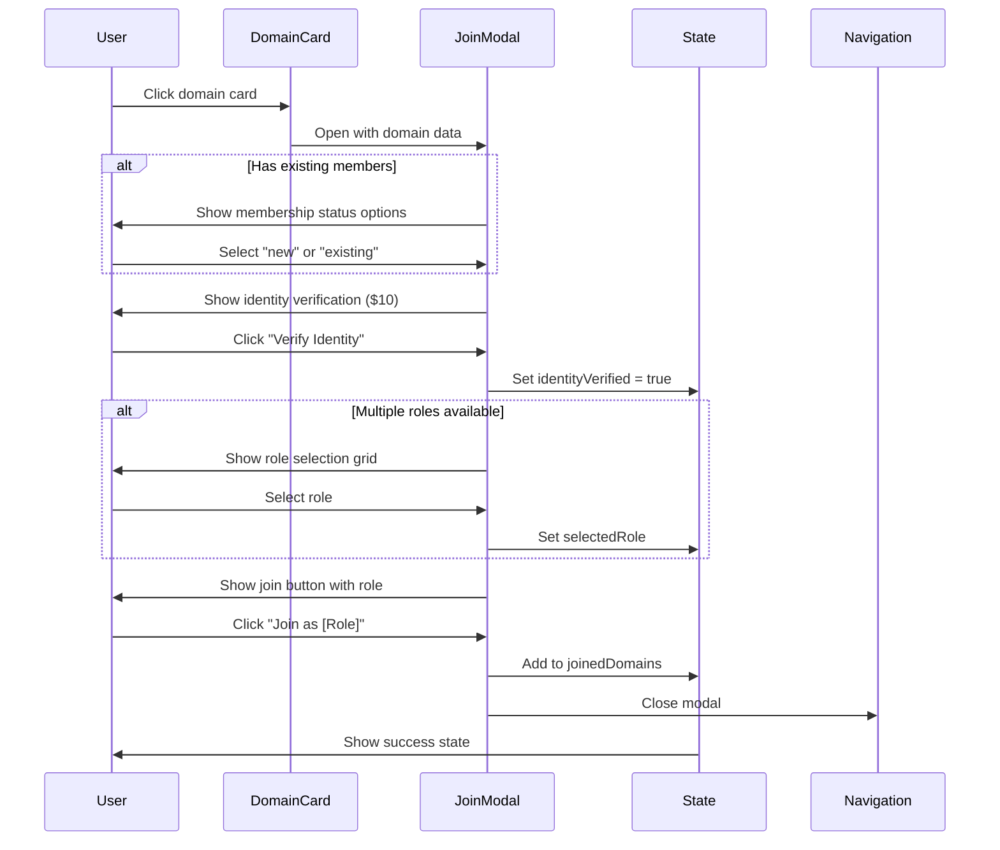
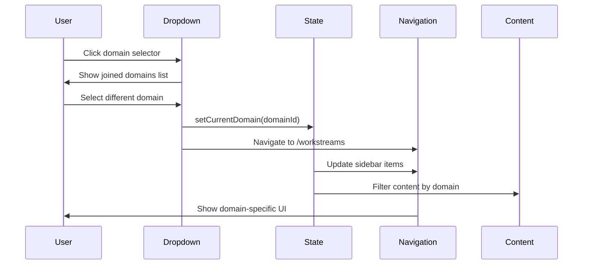

# Interaction Flow Diagrams

## 1. Domain Join Flow



## 2. Domain Context Switching Flow



## 3. Navigation State Management

```
┌─────────────────────────────────────────────┐
│                Initial State                 │
├─────────────────────────────────────────────┤
│ currentDomain: null                         │
│ activeSection: 'domains'                    │
│ sidebarItems: ['newworkstream']             │
│ recentItems: [generic items]                │
└─────────────────────────────────────────────┘
                      ↓
              User joins domain
                      ↓
┌─────────────────────────────────────────────┐
│              Domain Selected                 │
├─────────────────────────────────────────────┤
│ currentDomain: 'maven'                      │
│ activeSection: 'workstreams'                │
│ sidebarItems: ['newworkstream',             │
│   'workstreams', 'teams', 'procedures',    │
│   'tasks', 'dashboards']                    │
│ recentItems: [maven-specific items]         │
└─────────────────────────────────────────────┘
```

## 4. Component State Flow

```
App Layout
├── DomainContext (Global State)
│   ├── currentDomain
│   ├── joinedDomains
│   └── domain operations
│
├── UserContext (Global State)
│   ├── user profile
│   └── authentication
│
└── Component Tree
    ├── Sidebar
    │   ├── DomainSelector
    │   │   └── Dropdown (local state: isOpen)
    │   ├── NavigationItems
    │   │   └── filtered by currentDomain
    │   ├── RecentItems
    │   │   └── filtered by currentDomain
    │   └── UserProfile
    │
    └── Main Content
        ├── DomainBrowser
        │   ├── DomainGrid
        │   └── DomainJoinModal (local state: selectedRole)
        │
        └── Stubbed Sections
            └── EmptyState with domain context
```

## 5. Data Flow Architecture

```
Mock Data Layer
├── mockDomains[]
├── mockUser
├── mockUserMemberships[]
└── mockRecentItems{}
         ↓
    API Hooks
├── useDomains()
├── useUser()
└── useMemberships()
         ↓
    Context Providers
├── DomainProvider
│   ├── manages domain state
│   └── provides helper functions
└── UserProvider
    └── manages user state
         ↓
    Components
    └── consume via useContext()
```

## 6. User Journey Map

### New User Journey
```
1. Landing → /domains
   - See all 4 domains in grid
   - No joined domains indicator

2. Click Domain → Modal Opens
   - See join requirements
   - Identity verification step
   - Role selection (if multiple)

3. Complete Join → Success
   - Domain added to joined list
   - Redirect to /workstreams
   - Sidebar shows domain items

4. Explore Features → Stubs
   - Click navigation items
   - See "coming soon" messages
   - Domain context preserved
```

### Returning User Journey
```
1. Landing → /domains
   - See joined domain badges
   - Domain selector shows memberships

2. Switch Domain → Instant
   - Click dropdown
   - Select different domain
   - Context updates globally

3. Navigate → Domain Filtered
   - All content domain-specific
   - Recent items update
   - Role displayed in header
```

## 7. Error States & Edge Cases

### Empty States
- No domains joined → "Join a Domain" prompt
- Domain required → "Select a domain to view [section]"
- No recent items → Default welcome messages

### Loading States
- Domain grid → Skeleton cards
- Join process → Button spinner
- Navigation → Optimistic updates

### Error Handling
- Join failure → Show error message
- Network error → Retry button
- Invalid state → Redirect to /domains