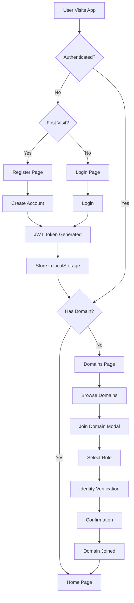
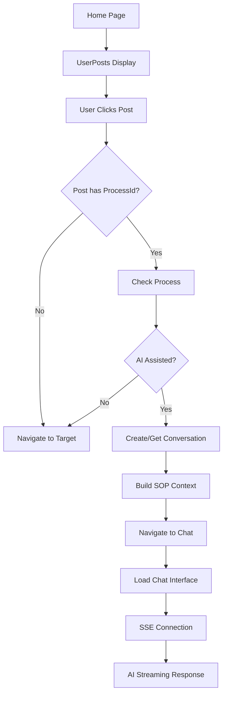
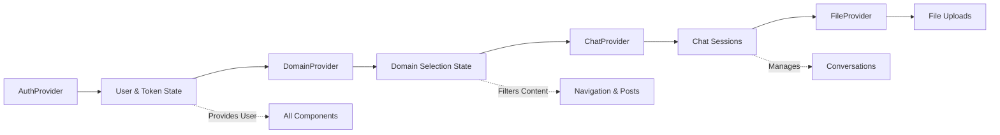
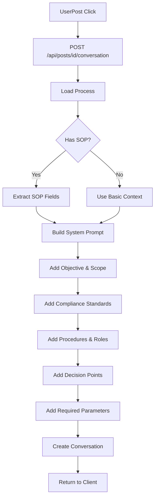
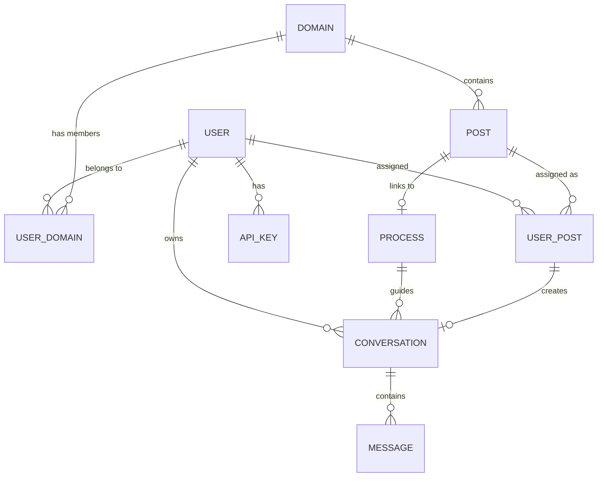
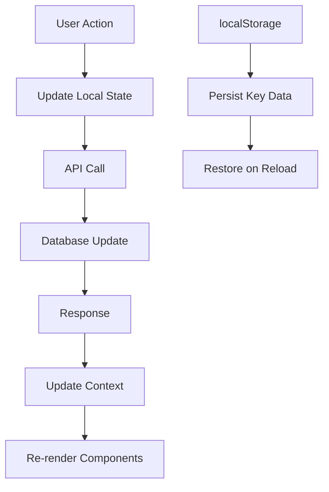

# User Flow Diagrams

## 1. Authentication & Domain Selection Flow



## 2. PostJourney to Chat Flow



## 3. Context Provider Data Flow



## 4. SOP Context Assembly



## 5. Component Hierarchy

```
RootLayout
│
├── Providers (Context Wrappers)
│   ├── AuthProvider
│   ├── DomainProvider
│   ├── ChatProvider
│   └── FileProvider
│
└── AppLayout
    ├── ProtectedRoute (Auth Guard)
    ├── SparkAppBar (Header)
    ├── Sidebar (Navigation)
    └── Page Content
        ├── Home (PostCards)
        ├── Domains (DomainCards)
        ├── Chat (ChatInterface)
        └── Other Pages
```

## 6. Database Relationships



## 7. API Request Flow

```
Client Request
    ↓
Middleware (Auth Check)
    ↓
Route Handler
    ↓
Database Query
    ↓
Business Logic
    ↓
Response Transform
    ↓
Client Response
```

## 8. State Synchronization

